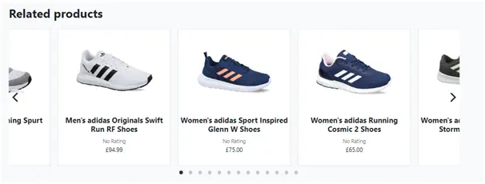
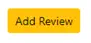
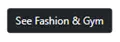
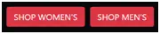

<h1 align="center">Sneaker Dadi </h1>
<span id="contents"></span>

## Contents

- <a href="#ux">User Experience (UX)</a>
- <a href="#feat">Features</a>
- <a href="#tech">Technologies Used</a>
- <a href="#test">Testing</a>
- <a href="#deploy">Deployment</a>
- <a href="#cred">Credits</a> 


[View the live project here.](https://sneaker-dadi.herokuapp.com/)

Sneaker Dadi is an online shopping site for Adidas footwear.  It seeks to provide a stylish and easy-to-use shopping experience.  The website signposts options, provides status and feedback to users at all stages of the shopping process.  It is designed for and tested on a range of devices including desktop PCs, tablets and mobile phones.
<span id="ux"></span>

## User Experience (UX)
### User stories
#### Goals per user type
|**No**|**User type**|**I want to..**|**So that I can..**|
|---|---|---|---|
|1|First time visitor|Quickly understand what the site is about|Decide to stay longer|
|2||Browse products easily |Find products to buy|
|3||Search for sale products|Save money|
|4||Read item reviews which show verified user|Check product quality|
|5||Show related products|Be notified of other products of interest|
|6||Buy an item without registering|Save time|
|7||Register easily|Save my details and add a review|
|8||Receive feedback throughout order process|So I can buy easily|
|9||Recover my password if needed|Log back in if forgotten password.|
|10||Ensure my account is secure|Have peace of mind|
|1|Returning visitor|Log in and out easily|To use saved details and add a review|
|2||Save my contact details|Save time|
|3||See previous orders|See what I have purchased|
|4||Shop easily on all devices|Shop conveniently|
|5||Add a review|To show appreciation or complain|
|6||Receive free delivery|Save money|
|1|Site Owner|Ensure site is secure|Secure my business and reputation|
|2||CRUD for shopping items|Change stock according to popularity|
|3||CRUD for sale items|Control sales strategy|
|4||Delete reviews |Remove inappropriate reviews|

### Design 
A conventional Bootstrap light-coloured navbar is available on all pages.  On Desktop view, a brand logo and site name have been added on the left followed by shopping links for all products, female, male, unisex and sale.  From the right, there is the cart, sign in options and search bar.  Below this is a contrasting darker header section with hero image, call-to-action with Shop Women’s and Shop Men’s buttons.
<div align="left"></div>

There are four other different header sections used throughout the site. 

<div align="left"></div>
<div align="left"></div>
<div align="left"></div>
<div align="left"></div>

The home page was created using the ‘Landing Page’ template from startbootstrap.com.  This provides an attractive and informative initial showcase for the product range.  The Best Sellers are shown using Bootstrap cards in a carousel at the top of the page in a carousel.  As with all product cards throughout the site, these show whether the product is on sale and if so show the original price with a strikethrough and the sale price in red.  The rating for each product will also be shown if given.

<div align="left"></div>

Below Best Sellers there are some showcase images, text and link to the mentioned products.  This section shows the products in real-life situations to encourage the customer to explore the different product ranges.

<div align="left"></div>

Following the product range showcase, the most recent male and female products bought by customers are shown in the Trending Right Now carousel.  

<div align="left"></div>

The footer on the home page is dark to match the header with social media links.

<div align="left"></div>

A light footer is used on other pages to correspond to the light header.

<div align="left"></div>

When a customer clicks on any of the navbar product links, the resulting product pages are based on the startbootstrap.com ‘Shop Homepage’ template.   The page body shows four products across on larger screens which is reduced in number for smaller devices.  The same Bootstrap cards are used as in the carousel on the home page so there is consistency.   
<div align="left"></div>

The product detail page is based on the ‘Shop Item’ template also from startbootstrap.com.  The header section is removed to allow screen space for the item image.  There is a plain white background to ensure the product is the main focus.  The layout includes a product title, description, size selector , ‘Add to cart’ and ‘Continue Shopping buttons.  There is a carousel showing four images of the product from different angles.

<div align="left"></div>

Below there is a Reviews section with the same light grey background colour as the navbar to distinguish this area from the product description.

<div align="left"></div>

Followed by a Related products section showing male and female products from the same category.

<div align="left"></div>

The Registration, Sign-up, email confirmation, login and profile pages all use the same functional design 
incorporating the aforementioned header and footer.

<div align="left"></div>

The shopping cart, checkout and checkout success pages are along the same lines.

<div align="left"></div>

<div align="left"></div>

<div align="left"></div>

### Colour Scheme
The template colour schemes were not altered.  The products stand out well against the plain white background with contrasting shaded areas for product review, related products and contrasting header and footer. 
### Typography
The template typography was also unchanged.  The default Bootstrap font was used throughout to be clear and readable.

The font color is generally dark with differences in some areas.  For example, the product review shows dark text for the comment set against grey text for the comment author and date.  The verified purchase text is brown/gold similarly used by Amazon.
<div align="left"></div>

### Buttons
A dark button with yellow background on hover was used to take the customer forward for all purchase actions, profile and site owner product updates.  To go back in the purchase process a button with black outline with black background on hover.

<div align="left"></div>

A yellow button was used to Add a Review with the standard purchase button in the Add Product Review modal.

<div align="left"></div>

For all customer admin functions such as register, login, password reset, etc. there is a dark button with contrasting dark background.

<div align="left"></div>

The links from the homepage are dark buttons with a white background on hover.  These provide more impact but without the yellow hover from the purchase process.

<div align="left"></div>

The usual red is used for Delete buttons with black outline for Cancel.

<div align="left"></div>

Product review authors have a pen icon to launch the Edit Product Review modal.  The site owner has a trash can icon to launch the Delete Product Review modal.

<div align="left"></div>

The shopping cart icon is in black outline with black background on hover.

<div align="left"></div>

If there are items in the cart the number is highlighted yellow.

<div align="left"></div> 

The search box and profile/product management button is in grey to match the other navbar links.

<div align="left"></div> 

The account management button has a grey (change to black?) background on hover as it’s secondary to the cart button.

<div align="left"></div> 

There’s a back to the top button on the product pages.

<div align="left"></div> 

### Imagery
The homepage header image features different sneaker types.  This is to make it clear this is what the website sells.  The imagery is paired with a humorous strap-line in order to build a fun Sneaker Dadi brand.  The Sneaker Dadi logo is an Adidas brand logo to reinforce that the site specialises in Adidas footwear.  The logo was found in an image search on Google using the Creative Commons licenses filter.

<div align="left"></div>   

The product description includes a main display image carousel.  As is standard with most ecommerce sites, it is important to show the product from different angles to improve the user experience and ease the buying decision.  The product image is also shown in the ‘Add to cart’ notification message and Order Confirmation page again to help the customer buy more easily.  Product images were either webp or jpg file types to reduce data size and ease website loading.

<div align="left"></div> 

#### Icons
Bootstrap Icons were used for all site icons such as star ratings, chevrons, trash can, pen, etc.

### Wireframes 
The wireframes for Desktop, Tablet and Mobile versions are [here.](https://github.com/thirdelement/sneaker-dadi/blob/master/media/readme/sneaker-dadi-wireframes.pdf)

These wireframes were created at the start of the project and although very similar to the resulting website include some features that were not implemented:
  - Wish List 
  - Add to Cart button on the product card 
  - Profile menu 
  - Change password
### Database model 
The database model uses a relational structure with tables for Product, ProductReview, Order, OrderLineItem, User, UserProfile and Categories.

As shoes are the only product sold, sizes are relatively straightforward and so could be held on the Product table.  The product table also holds a Boolean field to show whether the product was on sale, the discount percentage, average rating, gender and images.  The home page Best Sellers carousel is created from a query on the Product table filtering products by gender in descending order of the total sum of quantity sold for each from the OrderLineItem table.  Similarly, the Trending Right Now carousel is created from a query on the Product table filtering for products by gender ordered by descending purchase date from the Order table.

The Product Review table has a foreign key to the product and user tables.  It contains a text field for user comments, a rating from 1 to 5 and a Boolean field for verified purchase.  In order to check for a verified purchase an the ‘add_review’ view checks whether the same user profile has purchased the product from the OrderLineItem table.

Initially, average_rating was calculated via a function using the ProductReview model as shown:
<div align="left"></div>

The database schema is [here.](https://github.com/thirdelement/sneaker-dadi/blob/master/media/readme/sneaker-dadi-database-diagram.pdf)
<div align="right"><a style="text-align:right" href="#contents">Go to Contents :arrow_double_up:</a></div>
<span id="feat"></span>

## Features
- The Bootstrap toolkit was used throughout including:
  - [Grid](https://getbootstrap.com/docs/5.1/layout/grid/)
  - [Navbar](https://getbootstrap.com/docs/5.1/components/navbar/)
  - [Modal](https://getbootstrap.com/docs/5.1/components/modal/)
  - [Cards](https://getbootstrap.com/docs/5.1/components/card/)
  - [Carousel](https://getbootstrap.com/docs/5.1/components/carousel/)
  - [Forms](https://getbootstrap.com/docs/5.1/forms/overview/)
  - [Buttons](https://getbootstrap.com/docs/5.1/components/buttons/)
  - [Toasts](https://getbootstrap.com/docs/5.1/components/toasts/)

- Flickity carousel
  - [Flickity carousel](https://flickity.metafizzy.co/) was used for the carousels on the home page and on the product detail page for related products.  Unlike the Bootstrap carousel this allowed multiple frames to be displayed and has flexible configuration options.

- Django-multiselectfield
  - In order for the site owner to add in size availability according to stock levels, the [Django Multiselectfield](https://pypi.org/project/django-multiselectfield/) was used.  This provides checkboxes for each size option that can be purchased.
  <div align="left"></div>

- Notifications
  - Bootstrap toasts were used to feedback to the user on success (green toast capper), informational (blue toast capper) and error purposes (red toast capper).  

  Successful
  <div align="left"></div>
  Informational
  <div align="left"></div>
  Error
  <div align="left"></div>

- Product Reviews
  - If they are logged in a customer can add comments and a star rating for any product.  Once created, they can edit this review but not delete.  A site owner can create and delete any review but not edit.  The average star and numeric rating out of five is shown in the product detail and product listings pages.

- Verified purchase
  - A product review will show as ‘verified purchase’ if the customer who has left a review has previously purchased the product.

- Related products
  - On the product detail page related products are shown in the same category.  Products for the same gender will show in the carousel first followed by the other gender and unisex.

- Best Sellers
  - On the home page the Best Sellers carousel shows the top three male and female products sold by quantity.

- Trending Right Now
  - Also on the home page the Trending Right Now carousel shows the top three distinct male and female products most recently sold.

- Sale
  - A site owner can select whether a product is on sale with a check box and set the percent discount to the original price.  The product will then show from the Sale link on the navbar with the Sale badge, original price with a strike through and sales price.

- Cart/Checkout/Checkout success
  - The site has separate pages for cart, checkout and checkout success corresponding to each stage of the purchase process.  The customer is able to alter the quantity in the cart between 1 and 98.  The price for individual products, sub-total of quantity for each product size, overall cart total and order total after shipping cost is shown.

- Checkout
  - Name, email, phone, address and card details are required on the checkout page.  A checkbox provides an option to save the contact and address details back to the profile.

- Free shipping
  - A purchase below £50 will incur a flat £5.95 shipping cost.  If the purchase is over the £50 threshold then the shipping cost is waived.

- Profile
  - Customer’s contact details and order history are saved in their profile.  Contact details can be updated on the profile or check out pages.
  - Security is in place to ensure only the customer who submitted the order can see the order history.

- Add/Edit products
  - A site owner can create new product for the Product Management link on the navbar.  Existing products can be updated via the Edit and Delete links on each item in the product views.

- Search box
  - Full search capability on product titles and description.

- Defensive programming
  - Confirm Deletion
  - HTML validity
  - Non-public pages protected from non-authorised access.
  - Admin pages protected from non-admin access
  - Errors 404 and 500 handled by pages within the site.
  - Comprehensive user notifications

- CRUD
  - Site owners have full CRUD capability for products.

- Crispy forms
  - Used to improve function and style of forms.

- AWS S3 hosting
  - Static and media files hosted on AWS S3.

- Responsive on all device sizes tested
  - The use of the Bootstrap grid system and additional media queries enables the site to display effectively on a broad range of desktop, tablet and mobile screen sizes.  For example:
  - iPhone X
    <div align="left"></div>
  - iPad 768px
    <div align="left"></div>
  
### Future development
-   Features not implemented from Wireframes:
    - Wish List 
    - Add to Cart button on the product card 
    - Profile menu 
    - Change password
-   Filter on products page 
-   Calculations for VAT & postage in different countries 
-   Staff page to check all orders
-   Notification if no product stock
-   Graphical display to show goal progress.
-   Cart products saved to profile
-   Title on products page for categories
-   Magnification on product images
-   Use of AJAX to remove page refresh
-   Pagination
-   Contact form.
<div align="right"><a style="text-align:right" href="#contents">Go to Contents :arrow_double_up:</a></div>
<span id="tech"></span>

## Technologies Used
### Languages Used
-   [HTML5](https://en.wikipedia.org/wiki/HTML5)
-   [CSS3](https://en.wikipedia.org/wiki/Cascading_Style_Sheets)
-   [Javascript](https://en.wikipedia.org/wiki/JavaScript)
-   [Python](https://www.python.org/)
### Frameworks
1. [Bootstrap 5.1](https://getbootstrap.com/docs/5.1/getting-started/introduction/)
    - Bootstrap layout, content, components and utilities were used to structure the site and make it responsive.
1. [Django](https://www.djangoproject.com/)
    - Django was used to struture the site.
### Libraries  
1. [jQuery](https://jquery.com/)
    - jQuery has been used for the DatePicker, Bootstrap Tabs buttons and to check validity. 
1. [Bootstrap Icons](https://icons.getbootstrap.com/)
    - Bootstrap Icons was used for all site icons.
### Templates
1. [Start Bootstrap](https://startbootstrap.com/template/heroic-features)
    - The following Start Bootstrap templates were used:
        - [Landing Page](https://startbootstrap.com/theme/landing-page)
        - [Shop Homepage](https://startbootstrap.com/template/shop-homepage)
        - [Shop Item](https://startbootstrap.com/template/shop-item)
### Development & production platforms
1. [GitPod](https://gitpod.io/)
    - GitPod was used for code editing, version control, committing and pushing to GitHub.
1. [GitHub](https://github.com/)
    - GitHub was used to store and manage project code pushed from GitPod.
1. [Heroku](https://www.heroku.com/about)
    - Heroku was used for hosting the deployed web application.
1. [Postgres](https://www.postgresql.org/)
    - Live database
1. [SQLite](https://www.sqlite.org/index.html)
    - Demo database
1. [AWS S3](https://aws.amazon.com/s3/)
    - Hosting live static and media files.
### Other applications
1. [Irfanview](https://www.irfanview.com/)
    - Irfanview was used to resize, edit and add filters to images.
1. [Balsamiq](https://balsamiq.com/)
    - Balsamiq was used for [wireframes](https://github.com/thirdelement/goal-getter/blob/master/GoalGetter_wireframes.pdf) created during the design process. 
1. [RGB to Hex converter](https://www.rgbtohex.net/)
    - This website helped with converting RGB colours to Hex for Jumbotron images.
1. [Favicon.io](https://favicon.io/favicon-converter/)
    - This website provided the capability for Favicon generation.
1. [DB Diagram](https://dbdiagram.io/home)
    - Creation of database diagram.
<div align="right"><a style="text-align:right" href="#contents">Go to Contents :arrow_double_up:</a></div>
<span id="test"></span>

## Testing
See Test report [here.](https://github.com/thirdelement/sneaker-dadi/blob/master/TESTING.md)
<div align="right"><a style="text-align:right" href="#contents">Go to Contents :arrow_double_up:</a></div>
<span id="deploy"></span>

## Deployment
### Making a Local Clone
1.	Log into GitHub and locate the [Sneaker-Dadi repository](https://github.com/thirdelement/sneaker-dadi)
2.	Under the repository name, click ‘Clone or download’.
3.	To clone the repository using HTTPS, under ‘Clone with HTTPS’, copy the link.
    <div align="left"></div>
4.	Opt Git Bash
5.	Change the current working directory to the location where you want the cloned directory to be made.
6.	Type git clone, and then paste the URL you copied in step 3.<br>
`$ git clone https://github.com/thirdelement/sneaker-dadi`<br>
7.	Click Enter.  Your local clone will be created.

Please see [this link](https://docs.github.com/en/github/creating-cloning-and-archiving-repositories/cloning-a-repository-from-github/cloning-a-repository#cloning-a-repository-to-github-desktop) for more detailed explanation.

8.	Following Stripe documentation, create a Stripe account and in Developers on the API key tab find the public and secret key.
9.	Also in Stripe create a Webhook and find the Webhook secret key.
10.	Create an env.py file to contain the following environment variables.
    ```console
    os.environ.setdefault("SECRET_KEY", "<app secret key>")
    os.environ.setdefault("DEVELOPMENT", "True")
    os.environ.setdefault('STRIPE_PUBLIC_KEY', '<from Stripe>')
    os.environ.setdefault('STRIPE_SECRET_KEY', '<from Stripe>')
    os.environ.setdefault('STRIPE_WH_SECRET', '<from Stripe>')
    ```
11.	Create a .gitignore file ensuring *.sqlite3, *.pyc and __pycache__ are added.
    <div align="left"></div>
12.	Install all project requirements with ‘pip install –r requirements.txt’ 
13.	Run database migrations
    <div align="left"></div>
14.	Load category and product fixtures in following order
    <div align="left"></div>
15.	Create a superuser
    <div align="left"></div>
16.	Run the app 
    <div align="left"></div>

### Deploy to Heroku
1.	Login to Heroku
2.	Create new app
    <div align="left"></div>
3.	Add name , choose closest region and click Create app
    <div align="left"></div>
4.	In Resources create a new Postgres database
    <div align="left"></div>
5.	Select Hobby Dev-Free plan and click Submit Order Form
    <div align="left"></div>
6.	In your IDE install dj_database_url and psycopg2
    <div align="left"></div>
    <div align="left"></div>
7.	Import dj_database_url in settings.py
    <div align="left"></div>
8.	Replace default database with a call to dj_database_url.parse and give it the database URL from Heroku
    ```
    DATABASES = {
        'default': dj_database_url.parse('your-url-goes-here')
    }
    ```
9.	Run all migrations again for the Postgres database (see steps 11 to 13 in Making a Local Clone) 
10.	Install gunicorn to act as a webserver
    <div align="left"></div>
11.	Freeze requirements
    <div align="left"></div>
12.	Create a Procfile to tell Heroku to create a web dyno to run gunicorn to serve the Django app.  This should contain the following:
    <div align="left"></div>
13.	Login to Heroku from your IDE using your API key as the password
    <div align="left"></div>
14.	Temporarily disable collectstation so Heroku will not collect static files when we deploy.
    <div align="left"></div>
15.	In Settings, create the following Config Vars
    |**Key**|**Value**|
    |---|---|
    |AWS_ACCESS_KEY_ID|`<AWS ACCESS KEY ID>`|
    |AWS_SECRET_ACCESS_KEY|`<AWS SECRET ACCESS KEY>`|
    |DATABASE_URL|`<POSTGRES DATABASE URL>`|
    |DISABLE_COLLECTSTATIC|`1` |
    |EMAIL_HOST_PASS|`<APP PASSWORD FROM EMAIL ACC>`|
    |EMAIL_HOST_USER|`<EMAIL ACC>`|
    |SECRET_KEY|`<SECRET KEY>`|
    |STRIPE_PUBLIC_KEY|`<STRIPE PUBLIC KEY>`|
    |STRIPE_SECRET_KEY|`<STRIPE SECRET KEY>`|
    |STRIPE_WH_SECRET|`<STRIPE WH SECRET>`|
    |USE_AWS|True|
16.	Add the Heroku hostname to ALLOWED_HOSTS in settings.py
    <div align="left"></div>
17.	Commit & push to GitHub
18.	Initialise your IDE with Heroku and push to it.
    <div align="left"></div>
19.	In Heroku on the Deploy tab select GitHub as Deployment method
    <div align="left"></div>
20.	Search for respository and click Connect
    <div align="left"></div>
21.	Click Enable Automatic Deploys
    <div align="left"></div>

### Heroku - create app
1.	Log in to Heroku and click New, Create new app (also required to add name and region).
2.	In the Deploy menu, Deployment method select GitHub.
    <div align="left"></div>
3.	Check GitHub profile is displayed then add repository name and click Connect.
    <div align="left"></div>
    Do not enable Automatic Deploys at this time.  Since we have the env variables within the hidden env.py file, Heroku will not be able to read them.

4.	Click Settings, Reveal Config Vars and add details from env.py:
    <div align="left"></div>
5.	In Gitpod ensure that you commit and push requirements.txt and Procfile.
6.	Enable Automatic Deploys.
    <div align="left"></div>
7.	Click Deploy Branch.
    <div align="left"></div>
8.	Check app was deployed ok.
    <div align="left"></div>
    
### Gitpod - Connect Flask to Mongodb
1.	Install flask-pymongo which is a third party library required for Flask to communicate with Mongodb.
    <div align="left"></div>
2.	Install dnspython in order to use the Mongo SRV connection string.
    <div align="left"></div>
3.	Update requirements.txt and save.
    <div align="left"></div>
4.	Add additional imports to app.py to reflect new installations.  This includes BSON which is a JSON-like format in which Mongodb stores data.
5.	Update connection settings in app.py.
    <div align="left"></div>
### Mongodb - Connect to application
1.	In Mongodb go to Clusters, Overview, Connect, Connect your application.
    <div align="left"></div>
    <div align="left"></div>
### Gitpod - Additional settings
1.	Copy the connection string and add to MONGO URI value in env.py:
    <div align="left"></div>
2.	Add to MONGO_URI in ConfigVars in Heroku.
    <div align="left"></div>
3.	In app.py set up an instance of PyMongo and add the app using a constructor method.
    <div align="left"></div>
4.	Add initial get_goals function.
    <div align="left"></div>
5.	Add additional functionality from Flask.
    <div align="left"></div>
6.	Create the templates.
    <div align="left"></div>
7.	Create base.html as a parent template for all views and templates.  This contains all references to external files and third party libraries for Bootstrap, JS and CSS.
8.	Add Werkzeug to app.py and requirements.txt.
    <div align="left"></div>
### Gitpod - Additional settings
1.	Log into GitHub and locate the goal-getter repository
2.	Under the repository name, click ‘Clone or download’.
3.	To clone the repository using HTTPS, under ‘Clone with HTTPS’, copy the link.
4.	Opt Git Bash
5.	Change the current working directory to the location where you want the cloned directory to be made.
6.	Type git clone, and then paste the URL you copied in step 3.<br>
`$ git clone https://github.com/thirdelement/goal-getter`<br>
7.	Click Enter.  Your local clone will be created.

Please see [this link](https://docs.github.com/en/github/creating-cloning-and-archiving-repositories/cloning-a-repository-from-github/cloning-a-repository#cloning-a-repository-to-github-desktop) for more detailed explanation.
<div align="right"><a style="text-align:right" href="#contents">Go to Contents :arrow_double_up:</a></div>
<span id="cred"></span>

## Credits
### Code
- The site was based on the Code Institute Task Manager project.
- Bootstrap 4.6 was used throughout the site so that it is responsive to different devices and viewport sizes..
- Code was used from external sources in the following instances:
  - [Show HTML validity messages](https://stackoverflow.com/questions/32829776/setting-custom-html5-validity-message-property-ignores-pattern-regex)
  - [Display message if Add Goal form does not meet validity requirements](https://stackoverflow.com/questions/45789010/how-to-use-html-form-checkvalidity/45789752)
  - [Bootstrap Tab buttons](https://stackoverflow.com/questions/45789010/how-to-use-html-form-checkvalidity/45789752) 
  - [jQuery Datepicker](https://getbootstrap.com/docs/4.6/components/navs/#javascript-behavior)
  - [Several submit buttons on the same form](https://stackoverflow.com/questions/43811779/use-many-submit-buttons-in-the-same-form)
  - [Error 404 handling](https://www.geeksforgeeks.org/python-404-error-handling-in-flask/)
  - [Use background image and background color together](https://stackoverflow.com/questions/903659/why-cant-i-use-background-image-and-color-together)
  - [Correct regex usage](https://stackoverflow.com/questions/903659/why-cant-i-use-background-image-and-color-together)
  - [Regex pattern](https://regexr.com/)
  - [User login check](https://github.com/Edb83/self-isolution)
### Content
- All content was written by the developer.
### Content
The images used all had Creative Commons licences:
  - [Cogs](https://pixabay.com/vectors/gear-options-preferences-settings-149292/)
  - [Grow-diagram](https://commons.wikimedia.org/wiki/File:GROW_cycle.png)
  - [Man-crossroads](https://commons.wikimedia.org/wiki/File:Cartoon_Man_Arriving_At_A_Career_Crossroad.svg)
  - [Man-woman-trophy1](https://pixabay.com/vectors/business-competition-trophy-cup-5820660/)
  - [Mountains-success](https://pixabay.com/illustrations/success-customer-achievement-goal-4369215/)
  - [People1](https://pixabay.com/illustrations/people-cartoon-man-comic-fun-4879060/)
  - [Rocket](https://pixabay.com/vectors/rocket-rocket-launch-launch-space-4984618/)
  - [Woman-mountaintop](https://pixabay.com/vectors/success-woman-mountain-top-concept-5836546/)
  - [World-growth6](https://pixabay.com/vectors/world-growth-statistics-chart-6158920/)
  - [Target-arrow](http://www.mepixels.com/photo/target-2880)
  - [Favicon](https://pixabay.com/vectors/target-arrow-bulls-eye-bullseye-2070972/)
### Acknowledgements
-	Anto Rodriguez for his mentoring and advice.
-	Code Institute Tutors for assistance with structure and routing. 
-	Ed Bradley for MS3 prep session and useful example project.
<div align="right"><a style="text-align:right" href="#contents">Go to Contents :arrow_double_up:</a></div>