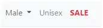
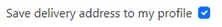

<h1 align="center">Sneaker Dadi Test report</h1>

## Contents

- <a href="#stories">User Stories</a>
- <a href="#manual">Manual Tests</a>
- <a href="#resp">Responsiveness</a>
- <a href="#issue">Issues & Bugs</a>
- <a href="#other">Other Tests</a> 

[View README.md](https://github.com/thirdelement/sneaker-dadi/blob/master/README.md)

[View the live project](https://sneaker-dadi.herokuapp.com/)

This document describes testing of the Sneaker Dadi site against the User Stories mentioned in the ReadMe file, manual tests and other automated tests for code validation and performance.

## User Stories
### First Time Visitor Goals
#### Quickly understand what the site is about
- The site is called Sneaker Dadi and a customer is immediately shown images of sneakers in the header and carousel below.  The strap line in the header on Desktop view mentions ‘Check out our fantastic Adidas footwear deals!’  In a glance, a customer should be left in no doubt what the site is selling.

#### Browse products easily
- The home page provides a useful showcase to the products on offer.  The carousels at the top and bottom of the screen show the best selling products and those most recently purchased.  The middle of the page displays images, descriptions and links to the main product ranges.  Furthermore, in the navbar there are links to All Sneakers and drop-down menus for Female and Male sneaker categories.  There are other links on the navbar for Unisex and sale pages.

- The navbar also features a search function which will find keywords from product titles and descriptions.  

- The user proceeds to set their goal, describe their reality, determine options and select at least one of these to work towards their goal.

- There is a ‘Sort by’ option on all the products pages from which the customer can order by price, rating and name from high to low and vice versa.

- On each header there are two large buttons for Shop Women’s and Shop Men’s which take the customer to the related products for each.

#### Search for sale products
- There is a link to sale products on the navbar.

- The products on sale have a red badge in the top right of the product card labelled ‘Sale’.  This should be clearly visible to customers in the product listings and carousels.

#### Read item reviews which show verified user
- Product reviews are viewable below the product description on the product detail page.
- If customer who left the review has previously purchased the product the review will show as ‘Verified Purchase’.

#### Show related products
- In the product detail page related products are shown below the reviews section in a carousel.
- These are products from the same product category.  Products with the same gender as that of the main product on the page will be shown first.  

#### Buy an item without registering
- Items can be purchased without registering.  
- However, in order to save contact and address details as well as leave a review registration is required.
- On the checkout page, there is a message to ‘Create an account or login to save this information’.

- On the product detail page there is a message to login or register to add a review.

#### Register easily
- The registration process can be initiated from either of the links mentioned above or from the Profile/Product Management button on the navbar.

- The registration process is dealt with using Django Allauth. 
- The customer signs up with email address, username and password.

- A verification email is sent with a link to confirm this is correct.  

- The link returns the customer to the Sneaker Dadi site where they need to click Confirm button to complete the process. 

#### Receive feedback throughout
- The customer receives success, informational or error messages to confirm actions throughout the site.  The success messages have a green cap, informational have a blue cap and error messages have a red cap.
- For example, when a customer has entered registration details an informational notification is shown:

- Once the email address is confirmed a success message is displayed:

- If a customer clicks the search button but without entering any text the following error is shown:

#### Recover my password if needed
- There is a ‘Forgot Password?’ link on the login screen.  

- The customer needs to re-enter their email address and click Reset My Password.  

- A confirmatory message is displayed. 

- The customer is sent a link to enter a new password. 

#### Ensure my account is secure
- Customers accounts are protected by Django Allauth.
- Payments are secured by Stripe and webhooks to ensure the process completes in spite of connection issues.
- Order history can only be seen by the customer who submitted the order.  If an attempt is made to access another customer’s order history an error is displayed.

### Returning Visitor Goals
#### Log in and out easily
- As mentioned, authentication is managed by Django Allauth.  
- The login and logout button is located in a standard position in the top right of the navbar in Desktop view or from the collapsible menu button on smaller devices.

#### Save my contact details 
- At checkout there is a checkbox to ‘Save delivery address to my profile’ for authorised users.

- If the above option is selected address details will be pre-populated for future orders.
 
#### See previous orders 
- Order history is available in the Profile page.

#### Share my goals with others 
- The site can be used conveniently across a range of device types.  It is responsive due to the use of Bootstrap and media queries.  See the Responsiveness section for more details. 

#### Add a review 
- The Add Review button is displayed in the Reviews section if the customer is authenticated and has not left a review already.  There is a one review limit per product for each customer.    
- An Edit option is available if the customer has already left a review.
- If the customer has previously purchased the product the review will show as ‘Verified Purchase’.
- The customer is unable to delete their review once created.  It is only Site Owners that have permissions to do this.

#### Receive free delivery
- There is a flat rate £5.95 delivery fee.  This is waived for all orders over £50.
- Customers are encouraged to spend more to qualify for free delivery.  This is done via the toast notifications and a message in the cart.

### Site Owner
#### Ensure site is secure
- See ‘Ensure my account is secure’ in First time visitor goals.
- Django @login_required decorators added to ensure authenticated access only to secure site areas.
- Allow superuser access only to admin areas via checks in views.py.

#### CRUD for shopping items
- A site owner has access to Product Management to create add new products.

- Existing products can be updated or deleted using the links in the cards on the product listings or on the product detail page. 
- When the Delete link is clicked a modal will appear to confirm deletion.

#### CRUD for sale items
- Items can be added to the sale via the check box on the Edit Product page.
- A discount percent can be set as desired.

- If ‘On sale’ is selected but a discount percent is not added an error will appear.

#### Delete reviews
- A site owner has permissions to delete any review.  This is done using the Delete button on each review.
- The site owner has permissions to update reviews created by themselves only.

- When the Delete button is clicked a modal appears to confirm deletion.

## Manual Tests
The following items have been successfully tested on each page or component:
### Menu bar
- Goal Getter logo link to home page.
- Menu bar links to correct site page.
### Home page
- Start Now! button links to Register for public user.
- Start Now! button links to Add Goal for session user.
- Find Out More! buttons link to About.
### About
- Start Now! button links to Register for public user.
- Start Now! button links to Add Goal for session user.
### Shared Goals
- Search bar finds items via goal name and chosen course of action.
- Search button working.
- Each goal shows the goal name, target date, creator and content correctly.
- Reset button resets search successfully.
- More Info button shows goal content and collapses on second click.
- Delete, Done and Edit buttons are available on each goal to Admin user and session user who created the goal only.
- Delete button launches Delete modal.  
    - Cancel on the modal returns to Shared Goals.
    - Delete on the modal removes the goal from the site and database.  A notification is shown on Deletion.
- Done button remove goal from page and notification shown.
- Edit button launches Add Goal form with previous answers.
### Log In
- HTML validation message showing correctly on both username and password boxes.
- Notification appears if details entered incorrectly and on successful login.
- Register account links re-directs correctly.
- User is logged in successfully and taken to profile.
- Welcome message displayed on login.
### Register
- HTML validation message showing correctly on both username and password boxes.
- Notification appears if details entered incorrectly and on successful login.
- Passwords are hashed successfully.
- Login link re-directs correctly.
- On registering correctly user is logged in and taken to profile.
- Welcome message displayed on login.
### Profile
- For new users profile is blank with links to add a goal.
- Once goal created it is shown in My Goals In Progress.
- More Info, Delete, Done and Edit buttons are available on each goal.
- More Info button shows goal content and collapses on second click.
- Delete button launches Delete modal.  
    - Cancel on the modal returns to Shared Goals.
    - Delete on the modal removes the goal from the site and database.  A notification is shown on Deletion.
- Done button moves goal to My Goals Completed.
- Edit button launches Add Goal form with previous answers.
- Each goal in My Goals Completed has a More Info, Delete and In Progress button.
- In Progress button moves the goal back to My Goals In Progress.
- A non-logged receives an error and is returned to the login page.
### Add Goal
- The tab links open each tab
- The Way Forward tab is disabled until the form is submitted on the Options tab.
- A non-logged receives an error and is returned to the login page.
#### Goal & Reality tabs
- HTML validation messages are showing correctly for each field.
- The Datepicker launches successfully.
- The drop-down menus work.
- The Next, Back and Cancel buttons work. 
#### Options tab
- Validation messages are showing correctly for each field.
- Cancel and Back buttons work. 
- Submit button takes the user to the Way Forward tab.
- A notification is displayed on submission.
#### Way Forward tab
- HTML validation messages are showing correctly for each field.
- Options are displayed correctly in the drop-down menus.
- The Datepicker works.
- The Meets goal switch is off by default and can be turned on.
- The Share switch is on by default and can be turned off.
- Cancel and Back buttons work.
- A message is displayed if Submit is clicked when the Meets goal switch is off and the form is not submitted.
- When Meets goal switch is on submission works.
- If the Share switch is on, the goal is displayed in Shared Goals and removed when off.

<a style="text-align:right" href="#contents">Go to Contents :arrow_double_up:</a>

## Responsiveness
- As the site has been designed using Bootstrap, it adheres to the Bootstrap grid layout and breakpoints.  Additional media queries have been used to align the jumbotron, switches, buttons, and home page call-to-action. 
- The website has been tested across a broad range of physical and virtual desktop, tablet and mobile devices.  Additionally, the site has been checked on a range of browsers including Chrome, Edge, IE11 and Firefox.
- Physical devices have included Windows Desktop PC and laptop, iPhone 8, SE, X and Samsung s10e. 
- Virtual devices have consisted of the following on Google Chrome:

- Some differences were found between Gitpod and Heroku that made alignment challenging when using the ‘Responsive’ option in Chrome Dev Tools.  This inconsistency disappeared when using the simulated device options.  The differences were not evident with ‘Responsive’ mode in Edge.  However, there were still alignment differences at the same width between a simulated device and ‘Responsive’ mode.  Therefore, a decision was made to align layout to simulated devices only. 
- For example, the first screenshot below shows the simulated iPhone 6/7/8 in Chrome with width 375px where the media query for ‘margin-top: 5px’ on the Edit button has triggered.  The second screenshot shows ‘Responsive’ mode in Chrome at the same 375px width but no media query trigger for the Edit button which does not activate until 355px.

#### Google Chrome simulated iPhone 6/7/8

#### Google Chrome Responsive mode

#### Media query

- In Responsive mode, the media queries for Chrome were activated at least 40 pixels less than the max-width (i.e., at 380 instead of 420px).  In the screenshots below the query for ‘margin-top 5px’ at ‘max-width 427px’ on the Edit button has been activated on Gitpod but not Heroku.  As you can see the width is showing at 385px which is well below the trigger level.

#### Gitpod

#### Heroku

- The media query below shows for Gitpod only.

<a style="text-align:right" href="#contents">Go to Contents :arrow_double_up:</a>

## Issues and Bugs
1.	Unable to edit course_of_action array element.
- Initially, there were problems updating individual array elements for course_of_action.
- This was made to work using the index in the HTML input value and $set statement on the route:

- **Fix:** Tutor Assistance advised that the HTML input name was changed rather than using the index so that it matches the getlist statement:

- The route was updated to:

2.	The user preferences for switches for meet_goal and to share goal do not update.
- On the add_goal.html page, the shared goal was checked by default:

- **Fix:** This has been updated with the database value using Jinja:

3.	Drop-down menus require user to re-select option when editing.
- **Fix:** Add selected value:

4.	On the Way Forward tab, the chosen_coa value does not show in the Edit_Goal form.
- **Fix:** Change the ‘chosen_coa’ type from array to string.
- In app.py replace $push which creates an array:

- with $set which creates a string:

5.	Sharing is not set by default on Edit_goal.html.
- **Fix:** On the /add_goal route change the default share position to ‘checked’.

6.	Options are not showing in the drop-down list on Way Forward tab.

- Earlier in the build, the form was spread over four different URLs.  The database document was created by the form on the first page and updated on subsequent URLs.  At the ‘Options’ stage this enabled values to be saved to the database prior to the ‘Way Forward’ page when one was selected from a drop-down list.
- Tutor support pointed out this method used several database transactions and is resource heavy.  This would become an issue if the application experienced increased usage.  In this case, the form was moved to tabs which could be submitted with one insert statement.  However, this did not enable the update of the drop-down menu on the Way Forward tab from the data entered on the Options tab.  
- **Fix:** As a workaround, the submit button was added to the Options tab and the Way Forward tab was disabled.  On submission, the user is re-directed to the Edit_Goal route with the Way Forward tab enabled so it can be submitted.
7.	Receive regex error when registering and/or logging in.

- **Fix:** Remove the ^ and $ and add a comma between 5 and 15 (credit: [W3Schools](https://www.w3schools.com/tags/att_input_pattern.asp) and [Regexr](https://regexr.com/))

Changed to:

8.	A goal changes from shared to not shared on submission.
- **Fix:** Update share variable to checked else unchecked.

9.	The user cannot see a regex message from a previous tab when submitting a goal.
- **Fix:** Add a Bootstrap alert to display if user clicks on submit and form validation is not met (credit: [StackOverflow](https://stackoverflow.com/questions/45789010/how-to-use-html-form-checkvalidity/45789752))

- JS: 

- Add_goal HTML:

10.	All fields have the same validate message.
- **Fix:** Update this code:

- To this:

11.	On Edit_goal.html if a user changes their options these are not updated in the drop-down menu on the Way Forward tab.
- **Fix:** Add a submit button on the Options tab ensuring the name is different from the button on the Way Forward tab. (credit: [StackOverflow.](https://stackoverflow.com/questions/43811779/use-many-submit-buttons-in-the-same-form))

- HTML:

- App.py:

12.	The notification received when validation is not met does is outside the viewport display.
- **Fix:** Add notification in the same location as other flash messages as well as directly above submit button.

13.	If the user clicks on the Way Forward tab instead of clicking Next button their Options are not saved and so not available in the Wayforward tab drop-down menu.

- **Fix:** Remove data-toggle=”tab” from the Way Forward tab so the Next button is the only option to move between tabs.

14.	Access can be gained to a user page without a session cookie.

- **Fix:** Add a check on each route in app.py that a user is logged in. 

- If not re-direct them to the login page and display a message.

15.	Adding the checked/unchecked boolean to the end of an input tag produces an error in the HTML validator.

- This was due to using the incorrect ‘unchecked’ Boolean in the URL route.

- **Fix:** This has been replaced with:

### Unresolved bugs
1.	The number selected from a drop-down menu appears again in the list of options.

- Possible fix: Add ‘break’ or ‘continue’ to the If statement with the Jinja Loop Controls extension. (see [Loop Controls](https://jinja.palletsprojects.com/en/2.11.x/extensions/#loop-controls)).  
2.	The fields on the Way Forward tab show as ‘None’ until the user enters details.

- Possible workaround: This ‘None’ value appears to be created on initial insert.  A validation rule could be added to force the user to change the value before submitting.

<a style="text-align:right" href="#contents">Go to Contents :arrow_double_up:</a>

## Other tests
### Code validation
- PEP8 online, JSHint, W3C Markup Validation Service and CSS Validation Service were used to validate all project pages ensuring no syntax errors are present.
### Site performance
- The Google Dev Tools Lighthouse audit for the site showed the following results:
#### Home

#### Get_Goals

#### About

#### Login

#### Profile

<a style="text-align:right" href="#contents">Go to Contents :arrow_double_up:</a>
