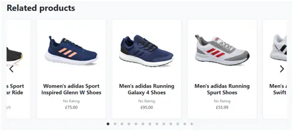
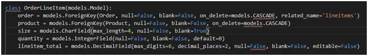

<h1 align="center">Sneaker Dadi Test report</h1>

## Contents

- <a href="#stories">User Stories</a>
- <a href="#manual">Manual Tests</a>
- <a href="#resp">Responsiveness</a>
- <a href="#issue">Issues & Bugs</a>
- <a href="#other">Other Tests</a> 

[View README.md](https://github.com/thirdelement/sneaker-dadi/blob/master/README.md)

[View the live project](https://sneaker-dadi.herokuapp.com/)

This document describes testing of the Sneaker Dadi ecommerce site against the User Stories mentioned in the ReadMe file, manual tests and other automated tests for code validation and performance.

## User Stories
### First Time Visitor Goals
#### Quickly understand what the site is about
- The site is called Sneaker Dadi and a customer is immediately shown images of sneakers in the header and carousel below.  The strap line in the header on Desktop view mentions ‘Check out our fantastic Adidas footwear deals!’  At a glance, a customer should be left in no doubt what the site is selling.

#### Browse products easily
- The home page provides a useful showcase to the products on offer.  The carousels at the top and bottom of the screen show the best selling products and those most recently purchased.  The middle of the page displays images, descriptions and links to the main product ranges.  Furthermore, in the navbar there are links to All Sneakers and drop-down menus for Female and Male sneaker categories.  There are other links on the navbar for Unisex and sale pages.

- The navbar also features a search function which will find keywords from product titles and descriptions.  

- There is a ‘Sort by’ option on all the products pages from which the customer can order by price, rating and name from high to low and vice versa.

- On each header there are two large buttons for Shop Women’s and Shop Men’s which take the customer to the related products for each.

#### Search for sale products
- There is a link to sale products on the navbar.

- The products on sale have a red badge in the top right of the product card labelled ‘Sale’.  This should be clearly visible to customers in the product listings and carousels.

#### Read item reviews which show verified user
- Product reviews are viewable below the product description on the product detail page.
- If the customer who left the review has previously purchased the product the review will show as ‘Verified Purchase’.

#### Show related products
- In the product detail page related products are shown below the Reviews section in a carousel.
- Related products are from the same product category.  
- Products with the same gender as the main product on the page will be shown first.  

#### Buy an item without registering
- Items can be purchased without registering.  
- Registration is required save contact and address details as well as leave a review.
- On the checkout page, there is a message to ‘Create an account or login to save this information’.

- On the product detail page there is a message to login or register to add a review.

#### Register easily
- The registration process can be initiated from either of the links mentioned above or from the Profile/Product Management button on the navbar.

- The registration process is dealt with using Django Allauth. 
- The customer signs up with email address, username and password.

- A verification email is sent with a link to confirm this is correct.  

- The link returns the customer to the Sneaker Dadi site where they are required to click the Confirm button to complete the process. 

#### Receive feedback throughout
- The customer receives success, informational or error messages to confirm actions throughout the site.  
- The success messages have a green cap, informational have a blue cap and error messages have a red cap.
- For example, when a customer has entered registration details an informational notification is shown:

- Once the email address is confirmed a success message is displayed:

- If a customer clicks the search button but without entering any text an error is shown:

#### Recover my password if needed
- There is a ‘Forgot Password?’ link on the login screen.  

- The customer is required to re-enter their email address and click Reset My Password.  

- A confirmatory message is displayed and email sent. 

- The customer has to click the link in the email to set a new password. 

#### Ensure my account is secure
- Customer accounts are protected by Django Allauth.
- Payments are secured by Stripe and webhooks to ensure the process completes.
- Order history can only be seen by the customer who submitted the order.  
- If an attempt is made to access another customer’s order history an error is displayed.

### Returning Visitor Goals
#### Log in and out easily
- As mentioned, authentication is managed by Django Allauth.  
- The login and logout button is located in a standard position in the top right of the navbar in desktop view or from the collapsible menu button on smaller devices.

#### Save my contact details 
- At checkout there is a checkbox to ‘Save delivery address to my profile’ for authorised users.

- If the above option is selected address details will be pre-populated for future orders.
 
#### See previous orders 
- Order history is available in the Profile page.

#### Share my goals with others 
- The site can be used conveniently across a range of device types.  It is responsive due to the use of Bootstrap and media queries.  See the Responsiveness section for more details. 

#### Add a review 
- The Add Review button is displayed in the Reviews section if the customer is authenticated and has not left a review already.  
- There is a one review limit per product for each customer.    
- An Edit option is available if the customer has already left a review.
- If the customer has previously purchased the product the review will show as ‘Verified Purchase’.
- Only Site Owners have permissions to delete reviews.

#### Receive free delivery
- There is a flat rate £5.95 delivery fee.  This is waived for all orders over £50.
- Customers are encouraged to spend more to qualify for free delivery.  This is done via the toast notifications and a message in the cart.

### Site Owner
#### Ensure site is secure
- See ‘Ensure my account is secure’ in First time visitor goals.
- Django @login_required decorators added to maintain authenticated access only to secure site areas.
- Allow superuser access only to admin areas is configured via checks in views.py.

#### CRUD for shopping items
- A site owner has access to Product Management to add new products.

- Existing products can be updated or deleted using the links in the cards on the product listings or on the product detail page. 
- When the Delete link is clicked a modal will appear to confirm deletion.

#### CRUD for sale items
- Items can be added to the sale via the check box on the Edit Product page.
- A discount percent can be set as desired.

- If ‘On sale’ is selected and a discount percent is not added an error will appear.

#### Delete reviews
- A site owner has permissions to delete any review.  This is done using the Delete button on each review.
- The site owner has permissions to update reviews created by themselves only.

- When the Delete button is clicked a modal appears to confirm deletion.

<a style="text-align:right" href="#contents">Go to Contents :arrow_double_up:</a>

## Manual Tests
The following items have been successfully tested on each page or component:
### Navbar
- Sneaker Dadi logo link to home page.
- Navbar items and drop-down menus link to correct site page.
- Search box finds items in product title and description by keyword.
- The search box shows an error if no search term entered.
- The cart button is highlighted yellow if products are present and shows the correct number of items.
- The Profile/Product Management drop-down menu shows Profile for authenticated users and Product Management for Site Owners.
- The navbar toggler is shown on smaller screen sizes and menu items display correctly.

### Header
- Shop Women’s and Shop Men’s buttons link correctly.
- Header image, text and buttons do not degrade or overlap or smaller screens.

### Footer
- Footer dark or light colour matches header.
- Social media links work.
- Text and icons are centralized on all screensizes.
- Check footer stays at bottom of the viewport on all pages.

### Home page
#### Best Seller Carousel
- The products displayed match those with the most quantity sold in the admin area.
- The Sale badge, star rating, numeric rating out of five, original price with strike through and sales price are shown correctly.
- The carousel shows the appropriate number of images on smaller screens with responsive card sizes.
- Product cards link through to the product detail page for the product shown.

#### Showcase text, buttons & images
- The showcase titles, texts, images and buttons are responsive and link correctly.

#### Trending Right Now Carousel
- The products displayed match those sold most recently.
- The sale badge, star rating, numeric rating out of five, original price with strike through and sales price are shown correctly.
- Product cards link through to the product detail page for the product shown.

### Products
- All products are displayed correctly at different screen sizes.
- Product number is shown correctly.
- Sort for price, rating and name orders items correctly.
- Back to top button works.
- The sale badge, star rating, numeric rating out of five, original price with strike through and sales price are shown correctly.
- Product cards link through to the product detail page for the product shown.

### Product detail
- The ‘no image’ graphic is displayed if a product image is missing
- Product ID, price category and description are shown correctly.
- The sale badge, star rating, numeric rating out of five, original price with strike through and sales price are shown correctly.
- Sizes are available and can be selected.
- Add to Cart and Continue Shopping buttons link correctly.
- Related Products show products from same category with the same gender first.
- Add Review button appears for authenticated users.
- Add Review button disappears once review added.
- Verified Purchase appears on review if customer has previously purchased the product.

### Products on sale
- All products with the ‘On sale’ box checked are displayed.
- All checks done as per Products page are successful.

### Add Product
- Product properties are all listed.
- Add Product form will not submit unless all mandatory fields are completed and valid.
- Choose File button for uploading images works ok.

### Site Owner features
- Edit and Delete links are shown on product detail page for all products in product listings.
- Edit link displays Edit Product page.
- Delete modal is displayed when Delete link is clicked.
- Product successfully deletes when Delete is clicked on modal.
- Delete button is available for all Product Reviews.
- Delete modal is displayed with Product Review Delete link is clicked.
- Product Review successfully deletes when Delete is clicked on modal.

### Profile
- Contact details and delivery address details are pre-populated from Checkout page.
- Contact details and address can be updated via the Update Delivery Info button. 
- Updated contact and address details are displayed on the Checkout page.
- Order History is shown correctly.

- Reference link for each order opens correctly.
- An informational notification is displayed to confirm this is a past order.

- The Back to Profile button works from the past order.

### Cart
- Displays product name, size, quantity and price correctly.
- Quantity is disabled below 1 and above 99 via increment/decrement buttons and manual entry.
- Remove link removes product from cart.
- The same product with different sizes is shown separately.
- The sub-total for each size is correct. 
- The sub total for the cart is correct.
- Delivery is shown for orders below £50 and is removed above that threshold.
- The order total shows correctly including delivery.
- The discounted price for sale items is used.
- Secure Checkout and Continue Shopping buttons link correctly.

### Checkout
- Pre-populated contact and address details are shown.
- The checkbox to save address details back to the profile works.
- A message is displayed advising the customer the correct amount will be taken from their card.

- The Complete Order button will not submit unless all mandatory fields are complete and valid.
- The card payment box accepts valid card numbers only and displays an error if not.
- The order details shown including number of items, sizes, sub-total, delivery and order total is correct.
- Complete Order button submits form and processing graphic is displayed.

### Checkout success
- Order number, date, delivery address, contact and order details are correct.
- Continue shopping button links correctly.
- Order placed successfully and notification is shown.

- Order appears in Admin area.
- Webhook attempts succeed.

### Notifications
- Toast notifications are shown correctly for success, informational purposes and errors.
- Notifications show all products in the cart with the correct price and total.
- The View Cart and Checkout buttons work on the notification.
- The correct number of shopping items are shown in the header.
- Notifications appear in top right corner and scroll with page.
- Notifications are dismissed on click.
- If more than one notification appears these are stacked.

<a style="text-align:right" href="#contents">Go to Contents :arrow_double_up:</a>

## Responsiveness
- As the site has been designed using Bootstrap, it adheres to the Bootstrap grid layout and breakpoints.  Additional media queries have been used to align many aspects of the site including header, images, font-size, images, buttons, etc. 
- The website has been tested across a broad range of physical and virtual desktop, tablet and mobile devices.  Additionally, the site has been checked on a range of browsers including Chrome, Edge, IE11 and Firefox.
- Physical devices have included Windows Desktop PC and laptop, iPhone 8, SE, X and Samsung s10e. 
- Virtual devices have consisted of the following on Google Chrome:

<a style="text-align:right" href="#contents">Go to Contents :arrow_double_up:</a>

## Issues and Bugs
**1.	Unable to update size in cart.html.**
- Received MultiDictKeyError from:

- **Fix:** Add hidden input value for size:

**2.	Unable to reach the cart/remove/<item_id> URL**

- Using console.log all values from JS look correct:

- **Fix:** Add forward slash to end of path.

**3.	Unable to close a toast.**
- Using Bootstrap 5.0, copied the correct toast HTML and attempted to launch with jQuery, however, the toast would not dismiss.
- With assistance from tutor support used following code:

- The toast dismissed, however, received error on page refresh:

- **Fix:** The message started to show without the above code so removed it and added some JavaScript to set the message display to none.

**4.	Unable to calculate the sub total for each product size in the message.**
- Attempted to use context.py but could only receive subtotal for the last round of iteration.

- Research shows this can be done in the template using the [django-mathfilters](https://pypi.org/project/django-mathfilters/) module.  However, it seems not best practice to work with data in the template.
- **Fix:** After checking Django docs and reviewing Code Institute videos, added `` at the top of the toast.   Therefore, could call cart_tools.py template tag and the calc_subtotal function. 

**5.	Unable to position bootstrap spinner in centre page.**
- The spinner was not aligned correctly with settings below settings from Code Institute example project:

- The above code caused the spinner to show as follows:

- **Fix:** Add the settings below:

**6.	Receive error when attempting to login after creating profile app on website and admin.**

- The traceback showed the following:

- **Fix:** Comment out the above code so a profile is created. 

- Login and set signal back to the way it was.

**7.	The template does not pick up MEDIA_URL.**

- **Fix:** Define the django.template.context_processors.media template context processor in settings.py.  See this [StackOverflow article](https://stackoverflow.com/questions/31925009/django-media-url-not-set-in-template)

**8.	If the Boolean field ‘on_sale’ in the Product model is True but nothing is entered for ‘discount_percent’ the following error is displayed.**

- **Fix:** Add the clean() method to the Product model as described in this [StackOverflow article](https://stackoverflow.com/questions/13440097/django-modelform-booleanfield-required-field-is-not-working)

- On implementation, same behaviour produces the desired form validation warning:

**9.	For style purposes attempted to configure allauth messages to display in the toast header only.**  
-To do this implemented an if statement:

- This appears to work apart from the last ‘or’ condition.
- **Fix:** Reverse if statement to following:

**10.	Receive the following time zone error:**

- **Fix:** Set USE_TZ in settings.py to False.  See this [StackOverflow article](https://stackoverflow.com/questions/18622007/runtimewarning-datetimefield-received-a-naive-datetime)

**11.	Problem retrieving image when using values() on queryset to retrieve top selling products on index.html.**

- The URL is not accessible due to the issue described in this [StackOverflow article](https://stackoverflow.com/questions/42729979/accessing-url-of-imagefield-via-values-method-on-django-queryset)
- With CI tutor assistance created a second queryset for adding the image.  This worked but found the initial query returned the total quantity of single purchases rather than total quantity sold.

- **Fix:** Followed the fix in this [StackOverflow article](https://stackoverflow.com/questions/9278796/ordering-a-query-by-aggregate-sum-in-django-but-not-getting-result-as-expected) to get the total quantity sold.

**12.	Receive TypeError join()argument error**

- **Fix:** Update review_rating field from CharField to IntegerField.

**13.	Unable to see existing text and rating when editing a review.**

- **Fix:** Add the Edit Product Review modal into the Product Review for loop and update the product_detail view as follows:

**14.	Customers' order history is accessible to anyone with the correct URL.**

- **Fix:** In the order_history view check if request is from the user who created the order: 

**15.	Unable to purchase product after migrating to Postgres database.**
- Receive following error when clicking ‘Complete Order’ after adding address details in check out:

- **Fix:** Update size in OrderLineItem from max_length 2 to 4

**16.	Carousel slides only half displaying on first load.** 

 

- After refresh the cards display normally.
- **Fix:** Add the Flicikity [imagesLoaded option](https://flickity.metafizzy.co/options.html#imagesloaded).

 

**17.	Unable to disable increment/decrement buttons on cart.html**
- **Fix:** With help from CI tutors changed IDs to classes to disable input below 2 and above 99.

 

 

**18.	Message notification for first image only appears on add/edit product page**
- **Fix:** With mentor assistance change the 'new-image' and 'filename' IDs to classes on the custom clearable file input page..

 

- Modify the Javascript with parent() and next() methods to get filenames for all images. 

 

### Unresolved bugs
**1.	Original_cart is displayed in json format in the admin area which is not user friendly.**

 

- Installed [django-flat-json-widget](https://pypi.org/project/django-flat-json-widget/) but this could not deal with multiple key pairs and would not work if original_cart was set to read only.

 

**2.	Delete ProductReview modal launches within Flickity carousel.**

 

- Workaround: Remove superuser options from modal.

<a style="text-align:right" href="#contents">Go to Contents :arrow_double_up:</a>

## Other tests
### Code validation
- PEP8 online, JSHint, W3C Markup Validation Service and CSS Validation Service were used to validate all project pages ensuring no syntax errors are present.
### Site performance
- The Google Dev Tools Lighthouse audit for the site showed the following results:
#### Home

 

#### Products

 

#### Product_detail

 

#### Cart

 

#### Checkout

 

#### Checkout success

 

#### Profile

 

#### Add/Edit product

 

<a style="text-align:right" href="#contents">Go to Contents :arrow_double_up:</a>
